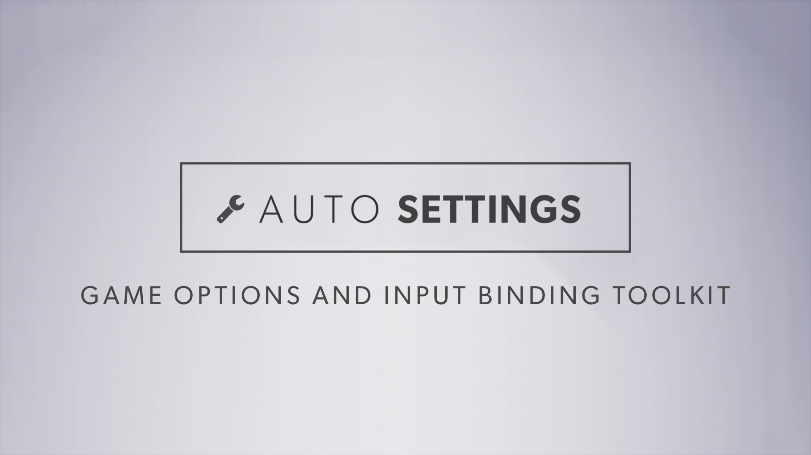
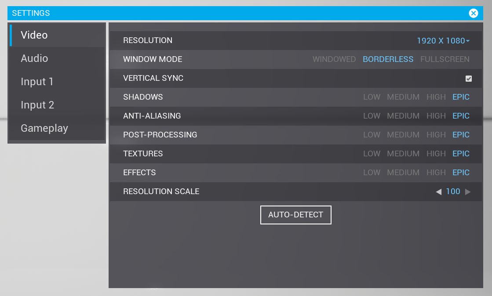

# Intro

**Auto Settings** is a game options and input binding toolkit for **Unreal Engine 4** that supports a range of functionality that is standard in modern PC and console games.

It is designed be as fast and simple as possible to use, building on top of and enhancing Unreal's systems so that it is painless to integrate with existing projects.

## Current Features

- Using this plugin to create settings and input binding menus requires no C++ and even no blueprint nodes, simply add the plugin to your project and start placing setting widgets in your UMG menus
- Example menu with common settings that you can copy to your own project if you choose
- Settings and input mappings load, save and apply automatically using Unreal's built in config .ini system, console variable system, and input system
- UI is modular can can be substituted with your own widgets and styling, preserving the functionality underneath

**Settings:**

- Built on top of Unreal's console variable system
- Defining a new setting is as simple as placing a new widget in your menu and choosing which console variable it is for
- Choose from any of the hundreds of built in console variables such as VSync, resolution, window mode, scalability settings, etc - these hook up automatically, no C++ or blueprint nodes are required for engine console variables
- Ability to define new console variables, access their values, and bind events that are called when they change, in C++ or in blueprint - so that you can create any additional settings you need that Unreal doesn't have by default
- Choose whether settings should automatically save when they are changed, or allow the user to manually apply, save, or cancel changes
- Multiple ready-to-use widgets such as Radio Select, Slider, ComboBox, Spinner, and CheckBox which can be dragged into your menu, link with the settings automatically, and can be restyled to match your game's theme
- Ability to make your own widgets that extend the system for more specific cases

**Input mapping and binding:**

- Actions and axis can be rebound by players at runtime
- Built on top of Unreal's input system and will work out of the box with your project - keep defining and using actions and axis like you are used to
- Adding a new input to your menu is as simple as placing a new widget and choosing which action or axis it is for
- Inputs can be mapped and stored separately for each local player in a single game instance
- Supports multiple bindings for the same action (such as "Primary" and "Secondary"), which can also be separated by key groups such as Keyboard and Gamepad
- Ability to create multiple presets which players can switch between
- Ability to whitelist or blacklist specific keys from being bound
- Supports key modifiers (Yes, you could let the player bind Jump to Ctrl + Shift + Mouse Wheel Down if you really want)
- Supports inverting axes
- Choose whether binding a new key should keep or remove other bindings with the same key

**Input key icons:**

- Key icon system for optionally displaying inputs as icons instead of text
- Easily access icon or text label for an input anywhere in your project so that your UI and prompts always shows the correct inputs
- Ability to define different icon sets for different platforms or gamepad types such as XBox and PlayStation and switch between them on the fly
- Ability to define different variants of icons such as small and large that can be used in different places in your project
