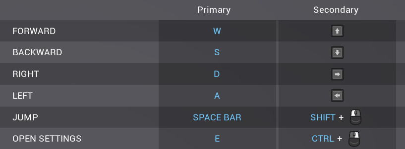
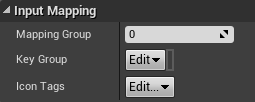
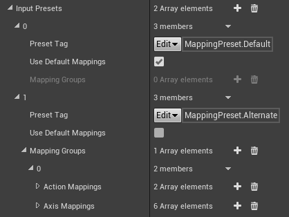
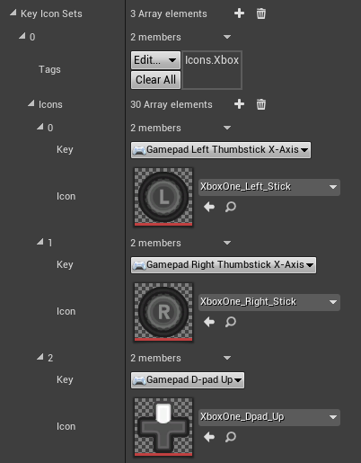
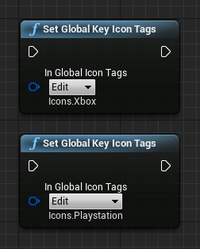
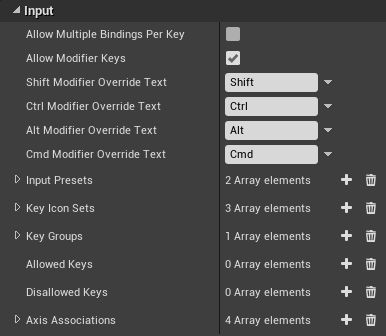
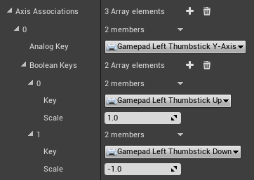

# Input Binding

Input binding buttons that allow users to re-bind actions and axes can be added to your menu with the **Action Mapping** and **Axis Mapping** widgets found under the **AutoSettings Input** pallette category.

These widgets show the current binding as text or an icon, and when pressed prompt the user for a new input to bind to.

Action mappings have an **Action Name** for the action to expose - for example *Jump*.

Axis mappings have an **Axis Name** and a **Scale**. If you have an axis configuration for *MoveForward* for which the *W* key has a scale of *1* and the *S* key has a scale of *-1*, you likely want to add two Axis Mapping widgets - one for *MoveForward 1*, and one for *MoveForward -1*. 

Mappings are stored per-player in `<Project or package>\Saved\Config\<Platform>\Input.ini` in the `[/Script/AutoSettings.InputMappingManager]` section.

In addition to these, both mapping widgets have the following optional properties:

- **Mapping Group** is used to allow the user to bind multiple inputs to the same action or axis - for example if your menu has two columns for input mappings. In this case, place multiple mapping widgets for the same action or axis and set them to use different Mapping Groups. A value of -1 tells the system to use the first available.

- **Key Group** is a gameplay tag used to separate groups of keys from each other.
If your project needs a column for Keyboard controls and a column for gamepad controls, instead of using Mapping Groups you should make Key Groups for each column containing the keys that should be allowed, and setting all of the input mapping widgets in each column to their respective Key Group. An empty Key Group represents “any”.

- **Icon Tags** are useful when your project needs to use different sets of key icons in different places of the project. In this case you would set the gameplay tag for the icon set you want to use, defined in the AutoSettings page in your project settings.

## Input Presets

Auto Settings supports setting multiple pre-defined input configurations that the user can select from at runtime. This can be used as well as or instead of allowing the user to bind their own inputs.

These can be defined on the **AutoSettings** page in your project settings, and are set up similarly to the regular Input page.
If you want, you can use the mappings on the regular **Input** page as one input preset by checking the **Use Default Mappings** property, and define mappings for additional presets on the AutoSettings page, or you can define all of them on the AutoSettings page. 

**Mapping Groups** are used to specify multiple bindings for an action or axis that can be rebound independently with Action Mapping or Axis Mapping widgets, which is useful if you want multiple columns of inputs in your UI. In this case, you should put mappings that would belong in different columns under different Mapping Groups. If not, you can just put everything under a single Mapping Group.

See example project for full implementation.

## Key Icons

By default, keys in input mappings and labels are displayed with a text label for that key.
Auto Settings can optionally substitute textures instead, which is particularly useful if you are making a console game where you might want to display a nice looking *A* or *X* instead of *Gamepad Face Button Bottom*.

Sets of key icons can be configured in the **AutoSettings** page of your project settings.

> *The example project uses Xelu’s free prompts pack found [here](https://opengameart.org/content/free-keyboard-and-controllers-prompts-pack)*

These key icon sets use gameplay tags for identification, which can be prioritised globally or on a per-widget basis, or both at the same time.

For example, if you had small and large variants of icons used in different places in your project, you could have one set of icons with the *Icons.Small* tag and another with the *Icons.Large* tag, and specify the tag for the set you want to use on the widget for the the input mapping or label.

You can prioritise a key icon set globally using the **Set Global Key Icon Tags** function, which is useful if you want to support switching between icons for different types of gamepads.

Since you can have multiple tags on a key icon set, these two methods of switching between them can be used at the same time allowing you to switch between gamepad type based on a setting, and switch between small or large variants based on location in project.

## Reading and displaying player mappings

It's common to need to display player mappings in UI, for example to prompt the player to perform an action. The **Action Label** and **Axis Label** widgets can be placed in your UI and used to automatically display the correct key icons or text label for an Action or Axis mapping, and also dynamically update when the player's mappings are changed, or their Key Groups are changed in case they switch input devices.

These widgets can be sub-classed following the [styling](/styling) guidelines to control the appearance including the text style and the icon sizes. These use the same logic as the **Action Mapping** and **Axis Mapping** widgets, and are in-fact used internally by them for displaying the current mappings.

If you want to directly read the active key mappings for a player, call the **Get Player Action Mapping** and **Get Player Axis Mapping** functions to access the key mappings applied to the player.

Please note the engine's built in **Get Action Mapping by Name** and **Get Axis Mapping by Name** functions on the **Input Settings** class will not be accurate for this use as they only retrieve the default mappings from the project settings and not the mappings that are actually applied to the player.

## Configuration

The input binding functionality of the plugin can be globally configured in the **AutoSettings** page of your project settings.

**Allow Multiple Bindings Per Key**

If true, users can bind the same key or combination to multiple actions or axes at the same time. If false, old mappings will be unbound by new ones.

**Allow Modifier Keys**

If true, users can use the modifier keys (Shift, Ctrl, Alt, Cmd) to create key combinations for action mappings. The modifier Override Text can be used to change how the labels for modifier keys appear if you want it to display “Shift” instead of “Left Shift”.

**Input Presets**

Preset input configurations for your project can be configured here. If empty, the mappings from the project’s **Input** page will be used.
See **Input Presets** section.

**Key Icon Sets**

Specify sets of key icons here.
See **Key Icons** section.

**Key Groups**

Any number of keys can be added to a key group so that they can be handled separately from other keys. You can specify allowed key groups on **Action Mapping** and **Axis Mapping** widgets to filter which keys can be bound to them. This might be useful if you want a column in your menu for keyboard controls, and another for gamepad controls, and want to allow both to be used interchangeably.
Players can also have a Key Group set on them to dynamically determine which key is chosen to display for a prompt label when no Key Group is set on the label widget. Set this by calling **Set Player Key Group** in Blueprint, or **UInputMappingManager::SetPlayerKeyGroupStatic** in code.
See example project for usage.

**Allowed Keys**

Whitelisted keys that the user is allowed to bind. If empty, all keys are allowed.

**Disallowed Keys**

Blacklisted keys that the user is not allowed to bind. Takes precedence over allowed keys.

**Axis Associations**

These are used to tell the system to associate keys with axes when capturing keys that the user is binding to an Axis.
This is useful for analog inputs such as gamepad thumbsticks where you might want the character to move half as fast when the thumbstick is pressed halfway.

If the user presses up on the left thumbstick to bind *Move Forward*, the correct mapping for the system to register would be *Gamepad Left Thumbstick Y-Axis* with a scale of *1*.
If no association is set, the system will register the raw user key pressed which in that case would be *Gamepad Left Thumbstick Up*. This would still move the character forward when pressed, but only support values of 0 and 1 and not analog values such as 0.5.

## Resetting saved inputs

You can provide the user with a way to reset their input mappings by switching to a preset.
Calling `Set Player Input Preset` or `Set Player Input Preset By Tag` will reset their mappings to the specific preset, which also serves as a way to reset to the defaults if the project does not have multiple input presets.
The example project demonstrates this using a preset switcher.

You can also manually clear the saved inputs from the `Input.ini` config file by deleting them from the `[/Script/AutoSettings.InputMappingManager]` section, **then restarting the editor.**

For more information on config files, see the [config files page.](/config-files/)