# Settings
## Setting Widgets

To add a setting to your menu, place the widget for the desired control type from the **AutoSettings Setting Controls** category anywhere in your menu.

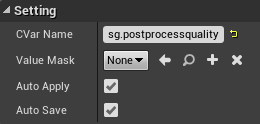

All settings have the following editable properties:

- **CVar Name** is the name of the console variable to expose - this can be a built-in Unreal console variable such as a scalability setting or vsync, one declared specifically for your project, or even one declared in another plugin if applicable.
*See [Console Variables](#console-variables).*

- **Value Mask** (optional) is a subclass of the **SettingValueMask** class used to split console variables into multiple independent settings in your menu.
*See [Value Masks](#value-masks).*

- **Auto Apply** - If true, the setting will automatically apply and call the console variable with the new value when the user changes the selection. If false, will need to be done manually with the Apply function.

- **Auto Save** - If checked, the setting will automatically update the config with the new value when the user changes the selection. If false, will need to be done manually with the Save or Cancel functions. Saved settings are stored in `<Project or package>\Saved\Config\<Platform>\Settings.ini` in the `[Settings]` section.

:::tip
It can be nice for layout purposes to wrap settings in a new *Setting Row* widget which consists of label text and a Named Slot to contain the control widget itself (See [example project](/example-project)) but you are free to set up the layout of your menu whichever way works best for you.
:::

## Select Controls

**Select** controls are controls with multiple named options for the user to select from.
These include the **ComboBox**, **Radio Select**, and **Spinner**.

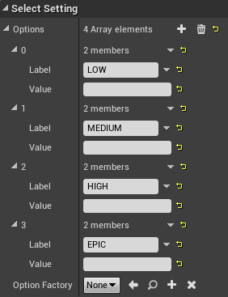

These settings have properties to determine which options they should allow.

- The **Options** property allows options to be predefined at design time, the **Label** being the text that the user sees and the **Value** being the internal value that is set on the console variable when selected. 
If an option has no Value, it instead defaults to use the index of the option, which is useful when creating settings for scalability variables which take integers.

- The **Options Factory** property (optional) is a subclass of the **SettingOptionFactory** class which can be used to dynamically construct a list of options for the setting by overriding the **ConstructOptions** function. For example, **ResolutionOptionFactory** constructs a list of all fullscreen resolutions that are supported by the system running the game.

## Applying and Saving Manually

You might not want to have your settings automatically apply or save when the user changes them.

In this case, you can uncheck the **Auto Apply** and **Auto Save** properties on the settings, and instead call the **Apply**, **Save**, and **Cancel** functions on the setting widgets manually.

You would likely want to call these functions when other buttons in your UI are pressed.

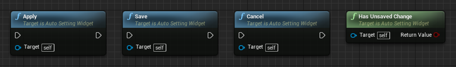

There is also a pure function called **HasUnsavedChange** which can be used to determine if a save button should be clickable, or to display a prompt to the user asking if they want to discard unsaved changes.

To make life easier, there are also versions of these functions that operate on multiple settings at the same time.

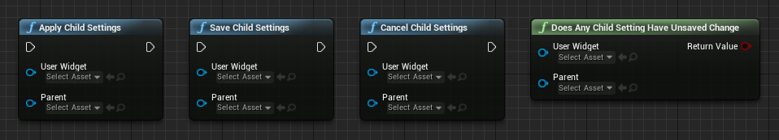

These functions operate on all the child settings in the layout of the User Widget (Blueprint widget) they are being called from, including settings in Named Slots. You can specify a User Widget to use instead, and also filter for settings that are underneath a specific parent widget, which might be useful if your menu has separate pages in the same User Widget which should be applied and saved independently from each other.

## Console Variables

Auto Settings is built on top of Unreal’s Console Variable (CVar) system, so adding a new setting always requires a CVar to exist for that setting. Unreal has hundreds of CVars built in which can be exposed with Auto Settings.

There are many common settings already implemented in the [example project](/example-project).

:::info
For a full list of CVars in the engine, check **Help > Console Variables** in the editor.
:::

There are also cases in which you might want to expose something as a setting that isn’t built into Unreal by default, for example audio levels.

There are a few components to doing this:

1. Registering the CVar
2. Using the CVar to control something in the game
3. Adding a setting for the CVar (already covered)

### Registering the CVar

Registering and using CVars in C++ is covered in the [Unreal documentation](https://docs.unrealengine.com/latest/INT/Programming/Development/Tools/ConsoleManager/index.html). If you are using C++, this is the best way to register a CVar.

There are also functions in this plugin to expose this to Blueprint, which we'll cover here.

Registering CVars is best done as early as possible, so if you are registering it in Blueprint it would ideally be in your GameInstance class in the **Init** event.

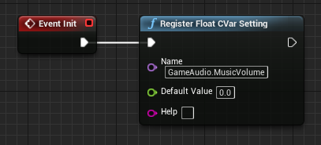

Here you can call functions to register **float**, **integer**, **string**, or **bool** CVars.
It’s also worth noting that these functions also check the settings config to see if there is a value stored, in which case that value is loaded instead of the default value parameter.

You can call these functions anywhere, but Init is the earliest point in Blueprint.

### Connecting the CVar

To actually make your new CVar do something, you’ll need to make your game check the CVar or respond to it in some way.

To check the value you can use the getter functions like this anywhere in your game:

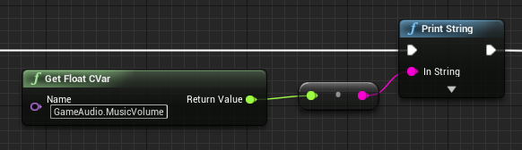

However in most cases you will want to have your game respond to the CVar and execute something when it changes, such as updating the audio volume.

This can be done by adding callback events which are fired when the CVar changes so that your game can respond to them.

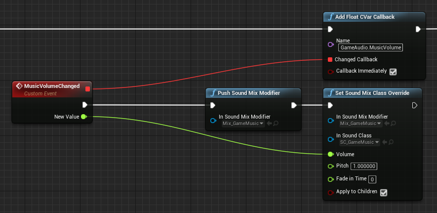

In this case we’re setting a sound mix’s volume to the value of the CVar whenever it is changed. If **Callback Immediately** is checked, the event will be fired with the current CVar value as soon as the callback is added, making it easier to apply the correct value when the game is launched or an object is constructed.

You can also register and bind a callback for a CVar at the same time, making it easier to organise your Blueprint if the CVar is being used in the same place it is being registered.

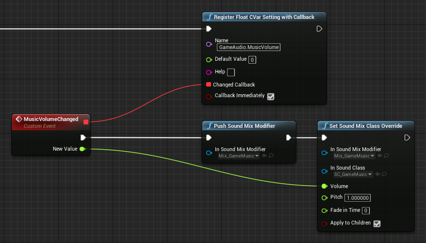

If this is set up correctly, the CVar should be registered, loading it’s value from the config if it is saved, and having some effect on the game when it is changed through the console. The only other thing that needs to be done is adding a menu setting to let the user control it as explained in the **Adding Settings** section.

Check the [example project](/example-project) for full implementation of custom CVars to control gameplay elements and audio levels.  
Or [read more about how to set up audio levels](#audio-levels) specifically.

### Manually setting the CVar

In most cases, there is no need to manually set the CVar value as it's controlled automatically by the [Setting Widget](#setting-widgets).  

If you do find the need, *this could be indicitive that you are not using the plugin correctly*, though there are still some legitimate cases where this is helpful.

To directly set CVar values you can use functions such as **Set Integer CVar** to do this. This is similar to typing it in the console.

Note that the **Set CVar** functions are the same as **applying** a setting, not **saving** it, so the new value will not be saved to config.

To save a setting to config, instead use the **Save Setting** function with the CVar as the Key, and the appropriate stringified value.  
This will cause the value to be applied again when new instances of the game are opened.

## Default Values

It's likely you'll at some point want to change the default values of your settings.

When registering a new CVar in either C++ or Blueprint, you are given the option to specify a default value.

This is useful when you are defining new CVars that are not built into the engine already, but you may find yourself with the need to change the default value of an existing CVar.

One way to do this in Unreal Engine, even without Auto Settings, is to use the `SystemSettings` category in the `DefaultEngine.ini` config file, like so:

```
[SystemSettings]
r.MyCvar = 2
```

If specified, the value in the file will apply when the engine is initialized, which will then be overridden by user's saved value if it has been changed.

For setting quality levels on different devices, it's recommended to use the [Device Profiles](https://docs.unrealengine.com/en-US/Platforms/DeviceProfiles/index.html) system.

## Auto-detect scalability settings based on hardware performance

It's possible to use the Unreal hardware benchmark to set the scalability settings to recommended values based on the user's hardware performance.
The `Auto Detect` function, which can be called from both Blueprint and C++, first runs the Unreal hardware benchmark and then applies and saves the resulting settings to the Auto Settings config.
There is a working example of a button which does this in the [example project](/example-project).

The performance threshold points that Unreal uses for each recommended setting level are controlled by config files.

The default settings are found in `BaseScalability.ini` in the engine:

```
[ScalabilitySettings]
; PerfIndexThresholds define the thresholds that determine what the autodetected quality should be for each group.
; When you auto detect performance, both a CPUIndex and GPUIndex are calculated on the machine.
; Use the console command "scalability auto" to print these values for a machine.
; The type of perfindex used to determine the quality for a group is either the GPU, CPU or Min.
; GPU means the quality is based on the speed of the graphics card. CPU means the quality is based on the processor, and Min means the group quality is based on the slower of either the CPU or GPU.
; Each group has a type followed by three numbers.
; The first number is the perfindex threshold that changes quality from 0 to 1. The second is the threshold from 1 to 2, the third is the threshold from 2 to 3.
PerfIndexThresholds_ResolutionQuality="GPU 18 42 115"
PerfIndexThresholds_ViewDistanceQuality="Min 18 42 105"
PerfIndexThresholds_AntiAliasingQuality="GPU 18 42 115"
PerfIndexThresholds_ShadowQuality="Min 18 42 105"
PerfIndexThresholds_PostProcessQuality="GPU 18 42 115"
PerfIndexThresholds_TextureQuality="GPU 18 42 115"
PerfIndexThresholds_EffectsQuality="Min 18 42 105"
PerfIndexThresholds_FoliageQuality="GPU 18 42 115"
PerfIndexThresholds_ShadingQuality="GPU 18 42 115"

; This is the screen percentage for the resolution quality, corresponding to 25% pixels, 50% pixels, 75% pixels, and 100% pixels
PerfIndexValues_ResolutionQuality="50 71 87 100 100"
```

To override them in your own project, you should set up a `ScalabilitySettings` section in the `DefaultScalability.ini` config file in your own project (create it if it doesn't exist).

## Value Masks

**Value Masks** can be used to split console variables into multiple independent settings in your menu.

Any Auto Settings setting control can optionally use a Value Mask by setting the **Value Mask** property to a subclass of the **SettingValueMask** class that determines how the value of the console variables should be split and recombined.


Example usage might be splitting the **r.SetRes** console variable - which contains both resolution and window mode in the form of *1920x1080wf* - into two separate settings, one controlling the resolution and the other controlling the window mode.

The plugin includes subclasses for splitting r.SetRes into resolution and window mode called **ResolutionValueMask** and **WindowModeValueMask**, but more subclasses can be created in either C++ or Blueprint to handle other cases.

The subclass should override the following two functions:

The first is the **Mask Value** function, which determines how to convert the console variable value into a format that the setting cares about.  
For example the Mask Value function of ResolutionValueMask would take the input value of *1920x1080wf* and return *1920x1080*.  
WindowModeValue Mask would just return *wf* (short for windowed fullscreen).  

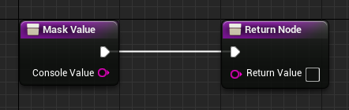

The second function is the **Recombine Values** function, which determines how to integrate the setting value back into the console variable value.  
In the case of ResolutionValueMask, this would take the current r.SetRes console value, for example *1920x1080wf*, and substitute in a modified resolution value, such as *2560x1440*, combining them into *2560x1440wf* which would form the new console value.  
In the WindowModeValueMask subclass, this would take the *1920x1080wf* console value, and substitute a modified setting value for window mode such as *f* (fullscreen), creating the final console value of *1920x1080f*.  

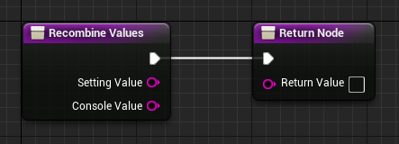

## Audio Levels

**Audio levels** are a common way to use custom settings in Auto Settings. The plugin itself does not treat audio levels differently to any other setting, so the correct way to use them is to add a setting to your project for each audio level and have them modify the **Sound Classes** in your project.

A working setup with multiple audio levels is implemented in the [example project](/example-project), though the following steps describe how to set one up from scratch:

1. Create a **Sound Class** asset for the new audio level
2. If applicable, set up parent or child Sound Classes. For example, if the new audio level is for **Sound Effects**, you may want to add the new **Sound Effect Sound Class** as a child of a **Master Sound Class** that you have already. This means the master volume will affect the sound effects.

	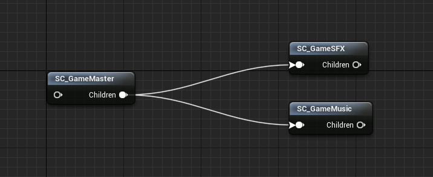

3. Create a **Sound Mix** asset for the new audio level
4. In your **Game Instance** class, [register a *float CVar*](#console-variables) and add a callback for the CVar which calls **Push Sound Mix Modifier** with the Sound Mix, and then **Set Sound Mix Class Override** with the Sound Mix and the Sound Class, and pass in the CVar value as the Volume. This is what actually changes the volume of the Sound Class when the value of the CVar is modified. 

	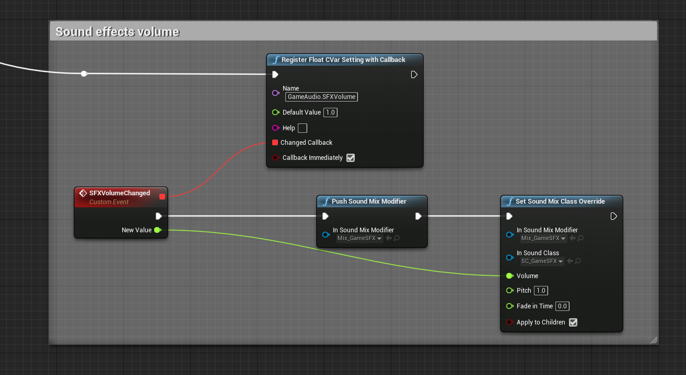

	:::note
	It's important that this happens after a **Delay** node (even with 0 duration) as the Audio Devices in Unreal are not created yet when the Game Instance **Init** function is called.
	:::

	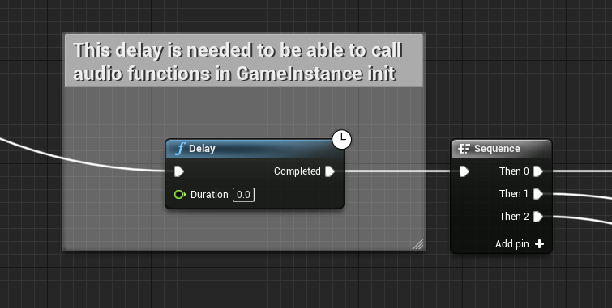
	
5. [Add a Setting Widget](#setting-widgets) to your menu to control the new CVar you created
6. Add the new Sound Class to all of the audio assets that should use the new audio level

:::tip
For music, it's recommended to enable **Virtualize when silent** on the sound asset. This makes it so when its volume is set to zero and then increased again, the music keeps its playback time rather than starting from the beginning again.
:::

## Custom Setting Widgets

In addition to the built-in Setting Widget types for common controls, you can create your own to handle more specific cases if you need.

1. Create a new **Widget Blueprint** or **User Widget** based on the **AutoSettingWidget** type. In Blueprint, you have to go to the **Graph** > **Class Settings** and set the **Parent Class**
2. Add any widgets for the actual visible layout of the setting
3. Override **Update Selection** and pass the **Value** to your UI. This is responsible for updating the view when the setting changes, including when the widget is first constructed.
4. When the user adjusts the UI, call **Apply Setting Value** with the **Value** that they selected. This will notify the system that the chosen value has changed, which may apply or save it as necessary.

Values should be converted to and from string format when interacting with these functions.