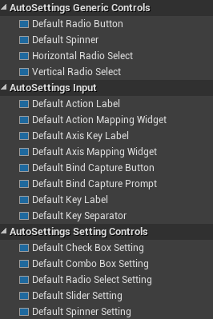
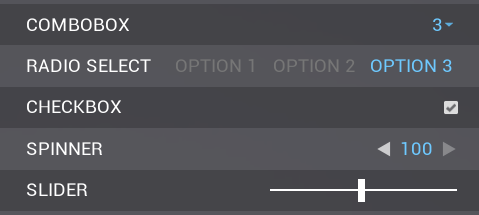

# UMG Widgets

After the Auto Settings plugin has been added to your project and enabled in the Plugins menu, the only step required to create basic setting and input binding menus is to add widgets to your menu.

If the Auto Settings plugin is installed correctly, you’ll find new categories in the UMG widget palette: 

- **AutoSettings Generic Controls** contains custom controls that are later extended to be usable as settings. These widgets are independent of any settings-specific logic and might be useful anywhere in your project, not just in your settings menu.

- **AutoSettings Input** contains widgets used for runtime input binding.

- **AutoSettings Setting Controls** contains controls (Both native UMG controls and also custom controls) that have been extended to be used in a settings menu. These can be tied to Console Variables to automatically apply when changed, and can save to config to be loaded and applied when the game is launched again.

Different settings controls with basic styling applied:

